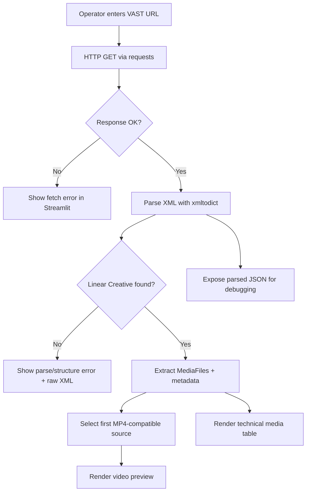

# VAST Tag Inspector & Player

A Streamlit-based VAST diagnostics toolkit for AdOps engineers to fetch, parse, validate, and preview video ad creatives from raw VAST XML tags.

[](https://www.python.org/)
[](https://streamlit.io/)
[](LICENSE)
[](#features)

> [!NOTE]
> This project is currently implemented as a lightweight interactive application (`app.py`) rather than a packaged Python distribution. You can still use it as an operational debugging utility in local, staging, or production-like environments.

## Table of Contents

- [Features](#features)
- [Tech Stack & Architecture](#tech-stack--architecture)
  - [Core Stack](#core-stack)
  - [Project Structure](#project-structure)
  - [Key Design Decisions](#key-design-decisions)
- [Getting Started](#getting-started)
  - [Prerequisites](#prerequisites)
  - [Installation](#installation)
- [Testing](#testing)
- [Deployment](#deployment)
- [Usage](#usage)
- [Configuration](#configuration)
- [License](#license)
- [Support the Project](#support-the-project)

## Features

- Fetches VAST XML payloads from remote endpoints using browser-like request headers.
- Parses XML into structured Python dictionaries via `xmltodict` for easier traversal and diagnostics.
- Handles common VAST structures including single-ad and multi-ad responses (first ad selected by default).
- Detects and extracts `Linear` creatives to identify playable ad media.
- Enumerates `MediaFile` entries and surfaces technical metadata including MIME type, bitrate, and dimensions.
- Auto-selects first browser-compatible `MP4` source for inline playback in the Streamlit UI.
- Displays key campaign/ad metadata such as VAST version, ad title, and duration.
- Provides an operator-friendly technical table for side-by-side media file comparison.
- Supports deep troubleshooting with raw XML and parsed JSON viewers in expandable debug panels.
- Includes a one-click sample Google VAST tag for rapid smoke testing and onboarding.

> [!TIP]
> Use this tool during integration and QA to quickly validate that ad server responses contain a valid `Linear` creative and at least one compatible MP4 asset for browser playback.

## Tech Stack & Architecture

### Core Stack

- **Language:** Python 3
- **UI Runtime:** Streamlit
- **HTTP Client:** Requests
- **XML Parsing:** xmltodict
- **Serialization/Debug Display:** Python `json` module + Streamlit JSON renderer

### Project Structure

```text
VAST-Tag-Inspector-Player/
├── app.py              # Main Streamlit application (fetch, parse, render)
├── README.md           # Project documentation
├── requirements.txt    # Python dependencies
└── LICENSE             # Apache 2.0 license
```

### Key Design Decisions

1. **Single-file runtime (`app.py`) for operational simplicity**
   - Keeps deployment and troubleshooting straightforward.
   - Minimizes boilerplate for fast iteration by AdOps and QA teams.

2. **Best-effort VAST traversal strategy**
   - Prioritizes practical debugging over strict schema enforcement.
   - Focuses on extracting actionable information from real-world, sometimes inconsistent responses.

3. **Fail-soft UX instead of hard crashes**
   - Network and parse exceptions are surfaced as readable messages.
   - Raw response remains available to support incident analysis.

4. **Visual-first diagnostics**
   - Combines metadata, playback preview, and source views in one interface.
   - Reduces context-switching between tools during creative validation.



> [!IMPORTANT]
> Current traversal logic is intentionally simplified and focuses on `InLine` + `Linear` creatives. Complex wrappers, nested redirects, and advanced VAST constructs may require extending parser logic.

## Getting Started

### Prerequisites

- Python `3.9+` (recommended)
- `pip` package manager
- Internet connectivity for fetching remote VAST tags
- Optional: virtual environment tooling (`venv`, `virtualenv`, or `pyenv`)

### Installation

```bash
git clone https://github.com/<your-org>/VAST-Tag-Inspector-Player.git
cd VAST-Tag-Inspector-Player

python -m venv .venv
source .venv/bin/activate  # Windows PowerShell: .venv\Scripts\Activate.ps1

pip install --upgrade pip
pip install -r requirements.txt
```

Run the application:

```bash
streamlit run app.py
```

Then open the local URL printed by Streamlit (typically `http://localhost:8501`).

## Testing

This repository does not currently include an automated test suite. Recommended validation workflow:

1. Start the app locally.
2. Use the built-in sample VAST endpoint.
3. Verify that metadata, media table, and preview render correctly.
4. Validate behavior with invalid or unreachable URLs.

Suggested commands:

```bash
# Dependency sanity check
python -m pip check

# Streamlit boot smoke test (manual stop with Ctrl+C)
streamlit run app.py
```

> [!WARNING]
> Since there are no formal unit/integration tests yet, regressions can slip in when parsing logic changes. Consider introducing `pytest` with fixture-based VAST payload snapshots for deterministic coverage.

## Deployment

### Local/VM Deployment

- Install dependencies with `requirements.txt`.
- Run via `streamlit run app.py` behind a reverse proxy if needed.
- Configure process supervision with `systemd`, `supervisord`, or container orchestration.

### Containerization Guidelines

If you need container-based deployment, use a minimal Python image and expose Streamlit's default port:

```dockerfile
FROM python:3.11-slim
WORKDIR /app
COPY requirements.txt ./
RUN pip install --no-cache-dir -r requirements.txt
COPY . .
EXPOSE 8501
CMD ["streamlit", "run", "app.py", "--server.address=0.0.0.0", "--server.port=8501"]
```

### CI/CD Integration (Recommended)

At minimum, implement pipeline stages for:

- dependency install
- `pip check`
- static linting (e.g., `ruff`)
- smoke startup check (`streamlit run app.py` in CI with timeout)

> [!CAUTION]
> In production environments, avoid exposing the app directly to the public internet without access controls, especially when operators may inspect third-party URLs.

## Usage

### Interactive Workflow

1. Launch the app with `streamlit run app.py`.
2. Paste a VAST URL into **Enter VAST Tag URL**.
3. Optionally click **Use Sample Google VAST Tag** for demo data.
4. Click **Analyze VAST** to process and inspect the response.

### Python-Level Function Behavior (from `app.py`)

```python
from app import fetch_vast, parse_vast

vast_url = "https://example.com/vast.xml"
raw_xml = fetch_vast(vast_url)

# Basic network failure guard
if raw_xml.startswith("http") or "Error" in raw_xml[:20]:
    print(f"Fetch failed: {raw_xml}")
else:
    data, error = parse_vast(raw_xml)
    if error:
        print(f"Parse error: {error}")
    else:
        print("VAST version:", data["version"])      # e.g. 3.0 / 4.1
        print("Ad title:", data["title"])            # Creative title
        print("Duration:", data["duration"])         # HH:MM:SS
        print("Media files:", len(data["media_files"]))
```

### What to Look for During Analysis

- Presence of a valid `Linear` creative.
- At least one playable `MP4` source.
- Correct duration and metadata consistency.
- Reasonable bitrate/resolution combinations across media renditions.

## Configuration

The project does not currently rely on `.env` files or CLI startup flags beyond Streamlit defaults. Configuration is primarily runtime-driven via the UI input field.

### Runtime Inputs

- **VAST Tag URL:** user-supplied remote endpoint to fetch XML from.
- **Sample URL helper:** one-click prefill with a known demo endpoint.

### Streamlit Startup Flags (Optional)

```bash
streamlit run app.py --server.address 0.0.0.0 --server.port 8501
```

### HTTP Behavior

`fetch_vast()` currently uses:

- hardcoded browser-like `User-Agent`
- `requests.get(..., timeout=10)`

You can extend this by adding:

- custom headers for partner APIs
- proxy settings
- retry logic with backoff
- stricter error classification

> [!NOTE]
> If your VAST endpoint is access-restricted (IP allowlist, tokens, signed params), ensure your runtime environment satisfies those constraints before troubleshooting parser output.

## License

This project is licensed under the Apache License 2.0. See [`LICENSE`](LICENSE) for full terms.

## Support the Project

[](https://www.patreon.com/OstinFCT)
[](https://ko-fi.com/fctostin)
[](https://boosty.to/ostinfct)
[](https://www.youtube.com/@FCT-Ostin)
[](https://t.me/FCTostin)

If you find this tool useful, consider leaving a star on GitHub or supporting the author directly.
